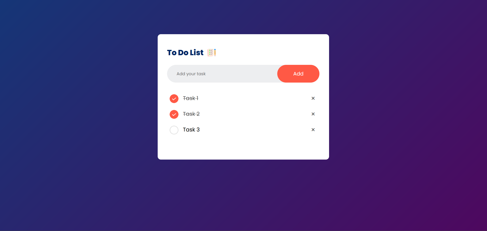

# To-Do List Application

This is a simple yet effective To-Do List Application built with HTML, CSS, and JavaScript. It allows you to manage your tasks and stay organized. You can add, edit, mark as completed, and delete tasks effortlessly.

## Tech Stack
<ul>
<li> HTML</li>
<li> CSS</li>
<li> JavaScript</li>
</ul>

## Installation

Clone the repository to your local machine:

git clone https://github.com/alasaidi/To-Do-List.git

Open the index.html file in your web browser to start using the application.
## Usage
<ul>
  <li> Add tasks with a simple click.</li>
 <li>Mark tasks as completed by clicking on the checkbox.
</li>
   <li> Delete tasks by clicking on the X icon.</li>
</ul>
  
